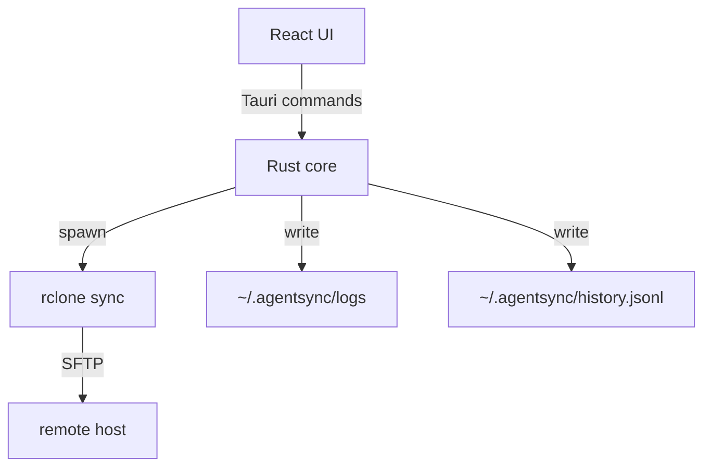

# 技术设计: AgentSync MVP（单向同步）

## 技术方案

### 核心技术
- 桌面壳：Tauri
- 前端：React + TypeScript（Vite）
- 同步：rclone（SFTP）

### 实现要点（大白话）

1) **界面**负责：让你点选文件夹、填连接信息、点“一键同步”、看进度/日志  
2) **后端逻辑**负责：把这些信息变成“同步命令”，并把结果回传给界面  
3) **真正的同步**交给 rclone：它成熟、跨平台，最不容易翻车

## 架构设计

## 架构决策 ADR

### ADR-001: 使用 rclone 做同步
**上下文:** 我们需要跨 Win/Mac/Linux 做稳定的文件同步，还要支持镜像删除、排除规则、进度与日志。  
**决策:** MVP 使用 rclone（SFTP 模式）作为同步引擎。  
**理由:** 成熟、跨平台、功能齐全，能显著降低我们“自研同步”踩坑概率。  
**替代方案:** 自己写 SFTP 同步 → 拒绝原因：复杂、容易出边界 bug（尤其删除/覆盖/恢复）。  
**影响:** App 需要能找到/调用 rclone（二进制可先要求用户安装，后续再做自动下载/内置）。

### ADR-002: 使用 Tauri 做桌面壳
**上下文:** 需要“能点选文件夹”的跨平台桌面 UI。  
**决策:** MVP 使用 Tauri + React。  
**理由:** 体积小、性能好、跨平台成熟；对“调用本地命令/打开文件选择器”支持好。  
**替代方案:** Electron → 拒绝原因：体积更大；而 MVP 我们更想轻量。

### ADR-003: 默认镜像删除，但必须备份
**上下文:** 用户明确希望默认镜像删除，但这属于破坏性操作。  
**决策:** 默认使用 `rclone sync`（镜像），并且强制开启 `--backup-dir`（把被删除/被覆盖的文件移到备份目录）。  
**理由:** 既满足“目标端和源端一致”，又能把误删风险降到可控。  
**替代方案:** 直接永久删除 → 拒绝原因：不符合“破坏性操作前必须备份”的安全要求。  
**影响:** 目标端会多一个备份目录，需要提供查看/清理策略（MVP 可先只提供查看路径）。

## API设计（Tauri commands 草案）

- `config_get` / `config_save`
- `connection_test`
- `sync_run`
- `runs_list` / `run_log_read`

## 数据模型

- `~/.agentsync/config.json`：保存连接信息、同步项、排除规则等
- `~/.agentsync/history.jsonl`：每次同步写一条记录
- `~/.agentsync/logs/<run_id>.log`：完整日志

## 安全与性能

- **安全:**
  - 不保存私钥内容，只保存 key 文件路径
  - 同步时不回显敏感信息（host/user 可以显示，key 路径可打码显示）
  - 目标端删除/覆盖统一进入备份目录
- **性能:**
  - 默认排除 node_modules/dist/build 等
  - 先按“一个同步项一个 rclone 命令”做，稳定后再考虑并发

## 测试与部署

- **测试:** 先做“命令拼装”和“路径映射”的单元测试；同步本身用本地/局域网做集成验证  
- **部署:** Tauri 打包出 Windows / macOS / Linux 安装包（后续再做自动更新）

