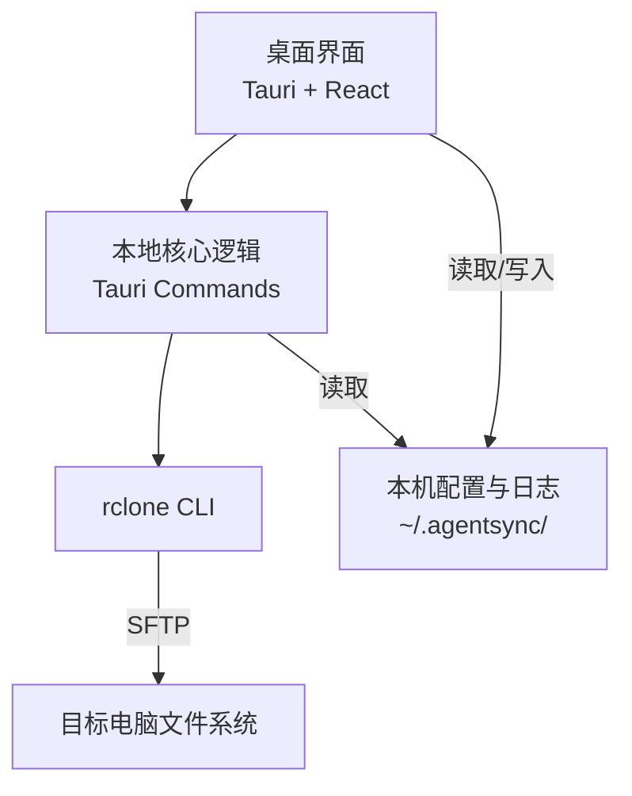
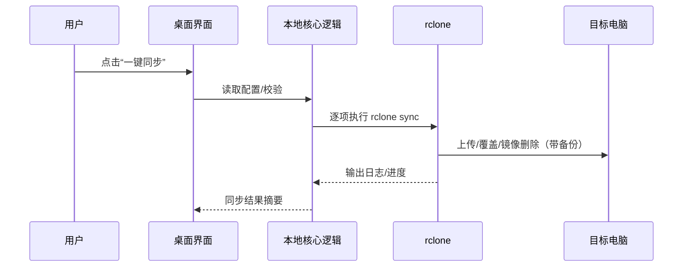

# 架构设计

## 总体架构（MVP）

## 技术栈
- **桌面壳:** Tauri
- **前端:** React + TypeScript（Vite）
- **同步:** rclone（SFTP）

## 核心流程（一次同步）

## 重大架构决策

完整 ADR 记录在每次变更的 `how.md` 中；本表提供索引（MVP 完成后会补充链接到 history）。

| adr_id | title | date | status | affected_modules | details |
|--------|-------|------|--------|------------------|---------|
| ADR-001 | 使用 rclone 做同步 | 2026-02-14 | ✅已采纳 | Sync Engine | 见 ../history/2026-02/202602140515_agentsync_mvp/how.md |
| ADR-002 | 使用 Tauri 做桌面壳 | 2026-02-14 | ✅已采纳 | UI | 见 ../history/2026-02/202602140515_agentsync_mvp/how.md |
| ADR-003 | 默认镜像删除但必须备份 | 2026-02-14 | ✅已采纳 | Sync Engine | 见 ../history/2026-02/202602140515_agentsync_mvp/how.md |
